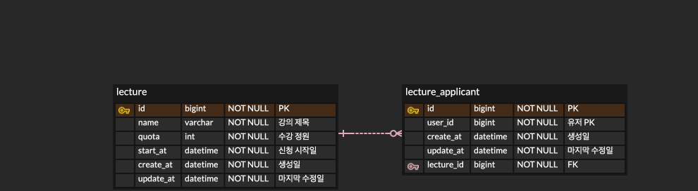

## [ 2주차 과제 ] 특강 신청 서비스

### Description

- `특강 신청 서비스`를 구현해 봅니다.
- 항해 플러스 토요일 특강을 신청할 수 있는 서비스를 개발합니다.
- 특강 신청 및 신청자 목록 관리를 RDBMS를 이용해 관리할 방법을 고민합니다.

### Requirements

- 아래 2가지 API 를 구현합니다.
    - 특강 신청 API
    - 특강 신청 여부 조회 API
- 각 기능 및 제약 사항에 대해 단위 테스트를 반드시 하나 이상 작성하도록 합니다.
- 다수의 인스턴스로 어플리케이션이 동작하더라도 기능에 문제가 없도록 작성하도록 합니다.
- 동시성 이슈를 고려하여 구현합니다.

### API Specs

1️⃣ **(핵심)** 특강 신청 **API**

- 특정 userId 로 선착순으로 제공되는 특강을 신청하는 API 를 작성합니다.
- 동일한 신청자는 한 번의 수강 신청만 성공할 수 있습니다.
- 특강은 `4월 20일 토요일 1시` 에 열리며, 선착순 30명만 신청 가능합니다.
- 이미 신청자가 30명이 초과되면 이후 신청자는 요청을 실패합니다.

2️⃣ **(기본)** 특강 신청 완료 여부 조회 API

- 특정 userId 로 특강 신청 완료 여부를 조회하는 API 를 작성합니다.
- 특강 신청에 성공한 사용자는 성공했음을, 특강 등록자 명단에 없는 사용자는 실패했음을 반환합니다.

---

### 심화 과제

3️⃣ **(선택) 특강 선택 API**

- 단 한번의 특강을 위한 것이 아닌 날짜별로 특강이 존재할 수 있는 범용적인 서비스로 변화시켜 봅니다.
- 이를 수용하기 위해, 특강 엔티티의 경우 기존의 설계에서 변경되어야 합니다.
- 특강의 정원은 30명으로 고정이며, 사용자는 각 특강에 신청하기전 목록을 조회해볼 수 있어야 합니다.

> 
> 💡 **KEY POINT**

- 정확하게 30 명의 사용자에게만 특강을 제공할 방법을 고민해 봅니다.
- 같은 사용자에게 여러 번의 특강 슬롯이 제공되지 않도록 제한할 방법을 고민해 봅니다.

---

### ERD
